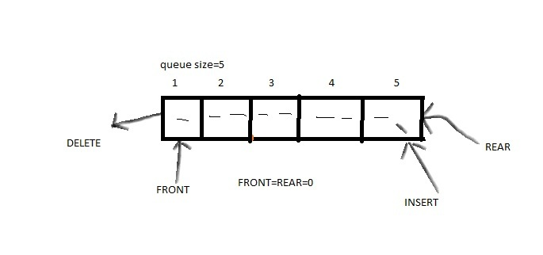

# Stack-code
with execution of code

##### Stack: 
            A stack is an abstract data type that serves as a collection of elements.
A stack is a container of objects that are inserted and removed according to the last-in first-out (LIFO) principle.
In the pushdown stacks only two operations are allowed: push the item into the stack, and pop the item out of the stack.
A stack is a limited access data structure - elements can be added and removed from the stack only at the top. 
push adds an item to the top of the stack, pop removes the item from the top. A helpful analogy is to think of a stack of books;
you can remove only the top book, also you can add a new book on the top.

PUSH:it is used for add or insert data to the stack.
 
POP: it is used for delete or retrive data to the stack.
 
PEEK: it display the top data in the stack.

TRAVARSE: it display's the data in stack. 

---
# ARRAY-LIST
with code
##### Definition:
            Java ArrayList class uses a dynamic array for storing the elements. It inherits AbstractList class and implements List interface.
         
Let's see the declaration for java.util.ArrayList class:
            *public class ArrayList<E> extends AbstractList<E> implements List<E>, RandomAccess, Cloneable, Serializable*

Generic Collection:
---
                        Java generic collection allows to have only one type of object in a collection(such as Int,String,Float).
                        ex:
                            public class Arraylist{
                                    public static void main(String[] args){
                                         ArrayList<String> al=new ArrayList<String>();
                                           al.add("mango");
                                           al.add("apple");
                                           al.add("orange");
                                           al.addFirst("grapes");//add at starting level
                                           al.addLast("banana");//add at ending level
                                           al.remove(3);//remove list
                                           al.set(1,"potato");//update list
                                            }
                                    }

---

# LINKEDLIST:
Linked List is a very commonly used linear data structure which consists of group of nodes in a sequence.

Each node holds its own data and the address of the next node hence forming a chain like structure.

Linked Lists are used to create trees and graphs.

Linked List implements Serializable and Clonable interface but not RandomAceess interface.

Linkedlist is the best choice if our frequent operation is insertion or delition in the middle.

linkedlist is the worst choice if our frequent operation is retrieval operation.

##### LinkedList Constructores:
                        LinkedList li=new LinkedList(); -->create an emptylist
                        LinkedList li=new LinkedList(Collection c); -->create an equivalent object
---
## Difference Between ArrayList and LinkedList:

##### ArrayList	                                                            
1. ArrayList internally uses a dynamic array to store the elements.	
2. Manipulation with ArrayList is slow because it internally uses array.If any element is removed from the array, all the bits shifts in memory.
3. An ArrayList class can act as a list only because it implements List only.
4. ArrayList is better for storing and accessing data.
##### LinkedList
1. LinkedList internally uses a doubly linked list to store the elements.
2. Manipulation with LinkedList is faster than ArrayList because it uses a doubly linked list, so no bit shifting is required in memory.
3. LinkedList class can act as a list and queue both because it implements List and Deque interfaces.
4. LinkedList is better for manipulating data.
---
---

# VECTOR
vector implements dynamic array. It is similar to Arraylist,but with two difference 
            1. vector is synchronized.
            2. vector contain lagacy methods thats not part of collection framework.
  ##### Vetor follows some points:
 * Its allow duplicate values.
 * Insertion order is Preserved.
 * Null insertion is possible.
 * Hetrogeneous objects are allowed.
 * Vector class implements serializable,cloneble and randoaccess.
 * It is best choice for if our frequent operation is retrieval.
 * Underlying datastructure for vector is Resizable array.
 
 
## Difference between ArrayList and Vector:
##### ArrayList:
1. ArrayList is not synchronized.
2. ArrayList increments 50% of current array size if the number of elements exceeds from its capacity.
3. ArrayList is not a legacy class.
4. ArrayList is fast because it is allow multiple thead methods at a time.
##### Vector:
1. Vector is synchronized.
2. Vector increments 100% means doubles the array size if the total number of elements exceeds than its capacity.
3. Vector is a legacy class.
4. Vector is slow because it is allow only one thread method at a time.
---

# SETS:
Set is chaild interface of collections. If we represents a group of individual objects as a single entity,whre duplicates are not allowed and insertion order not preserved, Then we use sets.sets does not contain any new methods.
            
Besically sets are:

1. HashSet
2. LinkedHashSet
3. SortedSet
4. NavigableSet
5. TreeSet
----      
## 1.HASHSET:
##### Importent points of HashSet:

   * The undelying datastructure is HASH TABLE.
   * Duplicates are not allowed,if we trying to insert duplicate values,we won't get any compilation and runtime errors,it's simply returns flase.
  * Insertion order not preserved and all objects will be inserted based on HASHCODE of objects
   * Hetrogeneous objects are allowed.
   * Null insertion is possible.
   * implementation os Serializable and cloneble are possible.
   * HashSet is best for our frequent operation is Search.
   
 #### Constructors of HashSet:

            1.  Hashset set=new Hashset();
                       - It is empty set with initial capacity=16 and default Fill ratio=0.75(it means after insertion of 75% increase capacity).
            
            2.  Hashset set=new Hashset(int initialcapacity);
                        -Creates an empty hashset object with specified initial capacity and default fillratio=0.75.
                        
            3.  Hashset set=new Hashset(int initialcapacity,float loadcapacity);
            
                        -Creates an empty hashset object with specified initialcapacity and loadfactor.
            
            4.  Hashset set=new Hashset(Collection c);
                        -For inter convention between collection object.
                        
------
## 2.LINKEDHASHSET:
  It is chaild interface of Hashset.
  
Importent points are:
   
 * It was introduced in 1.4 version.
 * It is exactly same as hashset except following difference
     1. The underlying datastructure is hashcode+linkedlist.
     2. insertion order is not preserved.
------
## 3.SORTEDSORT
  It is chaild interface of set. If we want individual objects represent according to some sorting order and without allow the duplicates,then we go for sortedset.

  ex: store employee details as per emp_id.
  
##### METHODS:

1. object first()
   - returns first element os sorted set.
2. object last()
    - returns last element of sorted set.
3. SortedSet headSet()
     - returns the sortedset whose elements are <obj.
4. SoretdSet tailSet()
     - returns the sortedset whose elements are >=obj.
5. SortedSet subset(Object obj,Object obj)
      - returns the sortedset whose elements are >=obj1 and <obj2.
6. Comparator comparator()
            -returns comparator object that describe underlying sorting techniques,if we are using default natural sorting order then we will get Null.
            
 -------          
## 4.NAVIGABLESET

It is chaild interface of SortedSet. It defines several methods for navigation purposse.

##### METHODS:

1. Floor(e): 
       -it returns highest element which is <=e.
2. Lower(e): 
       -it returns highest element which is <e.
3. Celling(e): 
        -it returns lowest element which is >=e.
4. higher(e): 
        -it returns lowest element which is >=e.
5. Pollfirst(): 
        -remove and returns first element.
6. Polllast(): 
        -remove and returns last element.
7. descendingset(): 
        -It returns navigableset in rever order.
           
-------
## 5.TREESET

Importent points of TreeSet are:
  
* The undelying datastructure for treeset is balenced tree.
* Duplicates are not allowed.
* Insertion order is not preserved,but all objects will be inserted according to some insertion order.
* Heterogeneous objects are not allowed,if we try to insert heterogeneous objects then we get runtim exception:class cast exception
* null insertion is possible,but it allow only once.

##### CONSTRUCTOR OF TREESET:
            1. TreeSet ts=new TreeSet();
                        -creates an empty treeset object where elemnts will be inserted according to DEFUALT NATURAL SORTING ORDER.
            2. TreeSet ts=new TreeSet(Comparator c);
                        -creates an empty treeset object where elemnts will be inserted according to CUSTOMIZED SORTING ORDER.
            3. TreeSet ts=new TreeSet(SortedSet s);
            4. TreeSet ts=new TreeSet(Collection c);
     

# MAPS

It is not a chaild interface of collection,Maps are perfect to use for key-value association mapping such as dictionaries.

If you have group of elements keep as pairs [key,value].

It was mainly used for add and retrive which values are based on Key.
 
*importent points:*

* Both kay's,value's are objects only.
* Duplicate key's are not allow,but duplicate values are allowed.
* Each key,value pair called Entry,hence a map consider as a collection of entry object.
  
##### METHODS:
  1. Object put(Object key,Object value):  -To add one key value pair to the map,if the key is alredy present,then old will be replaced with new value and returns old value.
            
  2. Void putAll(map m):  - put values of another map.
  3. Object get(Object key):    -return a value which based on key.
  4. Object remove(Object key):   - remove an key based value and key.
  5. Boolean ContainsKey(Object key):  - if key is present it return true,otherwise false.
  6. Boolean ContainValue(Object value):  -if value is present it return true,otherwise false.
  7. Boolean isEmpty():   - return true when map is empty.
  8. void clear():  - clear map data.
  9. int size():  -return size of map.
 
 
**Maps are considered as FIVE types:**

1. HASHMAP
2. LINKEDHASHMAP
3. SORTEDMAP
4. TREEMAP
5. NAVIGABLEMAP
           
            
###### ENTRY:-
 A map is group of keyvalue pairs and each keyvalue pair is called an entry.hence,map is consider as emptyObject without existing map object,no chance of existing emptyobject.

empty interface define inside map interface: 
---
                interface map{
                        interface entry{
                                    object getkey();
                                    object getvalue();
                                    object setkey();
                                    }
                          }
 
---
## 1.HASHMAP:
  * The underlying datastructure is hashtable.
  * Insertion order is not preserved and it is based on hashcode of keys.
  * Duplicate key are not allowed,the value can be duplicated.
  * Heterogeneous objects are allowed for both key and value.
  * Null is allowed for key(only once),null is allowed for values(many times).
  * Hashmap implements serilizable and cloneable interfaces,but not random access.
  * Hashmap is best choice when our frequent operation is Search operation.
  
  
##### Constructors for HASHMAP:
             1. HashMap hm=new HashMap();
                         -creates empty map with default initial capacity 16,with fill ratio is 0.75.
              2. HashMap hm=new HashMap(int initialcapacity);
                          -creates an emptymap object with specific initial capacity and default fillratio:0.75.
               3. HashMap hm=new HashMap(int initialcapacity,float fillratio);
                           - create an emptymap object with specific initial capacity and fillratio.
                4. HashMap hm=new HashMap(map m);
                           - creates emptymap with another map data insertion.
  
## 2.LINKEDHASHMAP:

Linkedhashmap is a child interface of Hashmap,only one difference it's introduced in 1.4 version.

It is also follow on key,value based list,here key allow only one null elements,but "value" can able to allow multiple elements.

It follow insertion order

LinkedHashMap is non synchronized
            
            
            Syntax:
                        LinkedHashMap<Integer,String> lsm=new LinkedHashMap
##### Advantages:
- It is cover the draw backs of the HashMap.
- It is extend of Hashmap.
- In Hashmap key,values are stored by using Hashcode,in LinkedHashmap it follows Insertion_order+Hashcode method.
- Mainly used at when we store a values and key at our own way.
- We mainly observe in this list at library systems.
- It allows Heterogeneous data.
 ---
 
## 3.SORTEDMAP:
It is an child interface of collection framework(Map Interface). this interface extends map interface and provide a total ordering of elements.

The default natural sorting order was done by key  and customized sorting order also done by key by using comparartor.

**METHODS:**

1. Object firstKey()
2. Object lastKey()
3. SortedMap headMap(Object Key)
4. SortedMap tailMap(Object Key)
5. SortedMap SubMap(Object Key1,Object Key2)
6. Comparator comparator()

 --- 
## 4.TREEMAP
Uderlying datastructure is redblack tree.

Insertion order is not preserved and its is based on some sorting order of keys.

Duplicate keys are not allowed,but values can be duplicated.

If we are depending on default natural sorting order compalsary keys should be homogeneos and comparable, otherwise we get CLASSCATEXCEPTION.

If we declare our own sorting order the keys need not to homogeneous, values may be homogeneous based on compare method.

NULLACEPTANCE: 
---
For non-empty treemap if we are trying to insert an entry with null key we will get ruen time exception:NULLPOINTER EXCEPTION.

For empty treemap as the first entry with null key is allowed, but after inserting that entry if we trying to any other entry then we will get runtime exception: NULLPOINTER EXCEPTION.

---
*NOTE: the above null aceptance rull will bw aplicable only upto 1.6v, after that we don't have null aceptance for key*

Treemap is chaild interface of naigablemap itss extends Sortedmap its Extends map. orally,Treemap is a chaild interface of map.

It was mainly used for to insert data into descending or ascending order with insertion order(key).it follows the insertion order.

##### Methods:
1. Submap
2. Tailmap
3. Headmap
4. ascending order/ascending order
  
CONSTRUCTOR
---

            1. TreeMap tm=new TreeMap()
                        - default natural sorting order by keys
            2. TreeMap tm=new TreeMap(Comparator c)
                        - our own sorting order by using comparator
            3. TreeMap tm=new TreeMap(SortedMap m)
                        - by using sortingodrer map 
            4. TreeMap tm=new TreeMap(Map m)
                        - by using prevoius map 
  
  
QUEUE
===
It is an algorithm.

It is an linear datastructure.

It is mainly absorve at ticket counter.

It follow FIFO(first in first out).

###### Methods

---
1. insert(add/offer)
2. delete(remove/poll)
3. travarse(display)

---
important points:
----

* in perform operation we required front and rear values.
* Front key position is fixed at position 0.
* Rear will preform both insert and delete operations.
* Rear in insertion it will increse 1 upto queue is full.
* Rear in deletion it will decrese 1 upto queue is empty.

  
  
  
  
  
  
  
  
  
  
  
  
  
  

